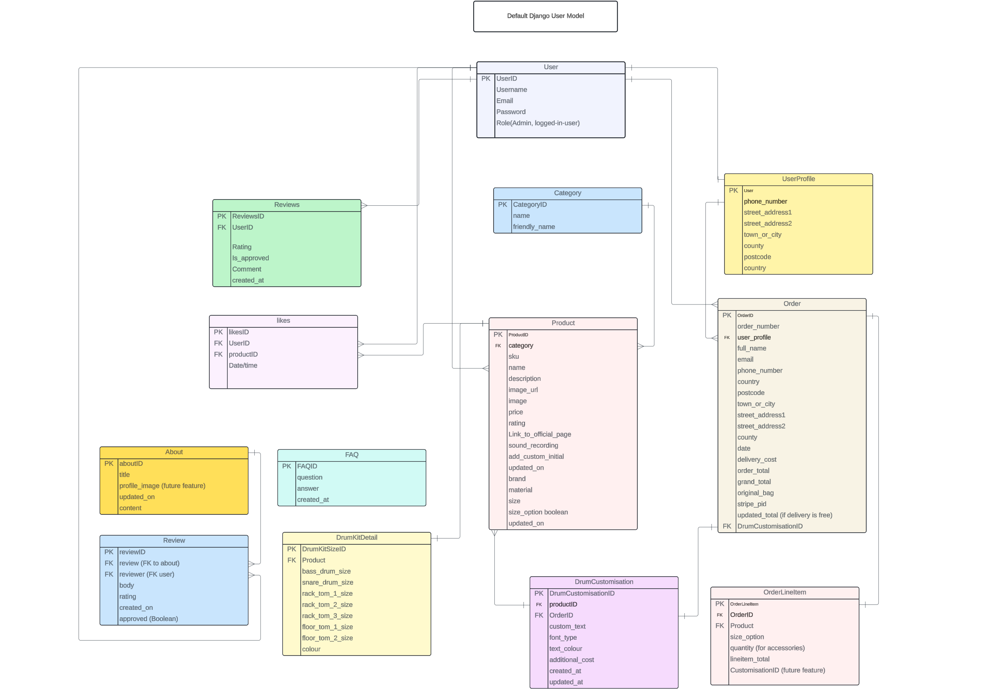
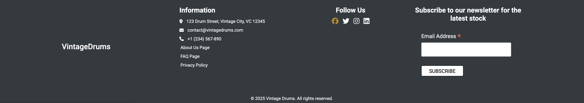

# Vintage Drums

[Andy O'Dwyer github](https://github.com/Andrewodwyer)

### Live App

[Link to Vintage Drums site](https://vintage-drum-store-6ce105a1b74f.herokuapp.com/)

### App description

<hr>
The Vintage Drum E-Commerce site is a premium online platform tailored for drum enthusiasts, musicians, and collectors seeking exceptional drums, cymbals, and accessories.

Product are showcased with photographs and accompanied by sound recordings, enabling users can see and hear the unique characteristics of each Drum and Cymbal before purchasing.

For customers purchasing full drum kits, the site offers a premium delivery and installation service by professional sound engineers, ensuring optimal setup and performance. Additionally, free delivery is available on orders over €500 for other products.

This site is designed to provide a luxurious and user-friendly shopping experience. Shoppers can browse products by entering key words in a search bar, by category or brands, and enjoy secure checkout processes. Registered users gain access to personalised profiles with features like, order history and liked products.

## Table Of Contents:
1. [UX & User-Centred Design](#ux)
    * [User Centred Design](#user-centred-design)	
    * [Target Audience](#target-audience)
    * [User Goals](#user-goals)
    * [User Stories](#user-story)
    * [Database Diagram](#database-diagram)
    * [Kanban](#kanban)
    * [Typography](#typography)
    * [MoSCow Prioritisation](#moscow-prioritisation)
    * [Epics](#epics)
    * [Story points](#story-point)
2. [UI](#ui-design)
    * [UI Design](#ui-design)
    * [Wireframes](#wireframes)
    * [Design](#design-style)
    * [Colour Palette](#colour-palette)
    * [Typography](#typography)
3. [Features](#features)
    * [Navigation](#navigation)
    * [Footer](#footer)
    * [Home page](#home-page)
    * [Products Page](#products-page)
    * [Product Details](#product-details)
    * [Shopping Bag](#shopping-bag)
    * [About Us](#about-us)
    * [FAQ](#faq)
    * [Profile Page](#profile-page)
    * [Checkout](#checkout)
    * [Order Confirmation](#order-confirmation)
    * [E-Commerce Business Model](#e-commerce-model)
    * [CRUD](#crud)
    * [DRY principles](#dry-principles)
    * [Authentication and Authorisation](#authentication-authorisation)
4. [Technologies Used](#languages)
    * [BootStrap](#bootstrap)
5. [Libraries](#libraries)
6. [Validator Testing](#validator-testing)
    * [Happy Path Testing](#happy-path-testing)
7. [Bugs](#bugs)
8. [Deployment](#deployment)
9. [Credits](#credits)


## UX
<a name="ux"></a>

### User-Centred Design Approach for planning and design.
<a name="user-centred-design"></a>

The primary goal in the planning and design of the Vintage Drum Store website is to create an intuitive, user-friendly shopping experience tailored to drum enthusiasts, musicians, and collectors. Every design decision is made with the customer in mind, focusing on showcasing the products in a way that is both functional and enjoyable to explore. From browsing drums and cymbals to secure checkout and personalised profiles, the site is designed to offer a seamless and engaging experience.

#### Target Audience
<a name="target-audience"></a>

 The platform serves a wide range of users, from professional drummers, seasoned musicians and collectors.

#### User Information:

- Age:

  - Professional musicians (typically 25–50 years old)
  - Drum enthusiasts and hobbyists of all ages.
  - Collectors of vintage and high-end musical instruments, often aged 30–60, who value sound quality and craftsmanship

- User Demographics:

  - Drummers
  - Collectors: People interested in rare or limited-edition drum kits and cymbals
  - Musicians who value the sound quality and history behind vintage instruments

- Location:
  Shipping throughout Ireland

#### Users’ Interests:

- Music & Performance
- Music Production & Recording: Sound engineers, producers, and session musicians

#### Regular Users:

- Drummers and Musicians
- Collectors and Enthusiasts
- Registered Users:
Regular users who create an account to track their favorite products, view order history, and save personalised profiles. They may also engage with the content of the site by reviewing products or sharing experiences with other musicians and collectors


#### How people will use the app:

- None Registered Users
  1. Browse Available Products.
  2. Search for products using key words in the search bar and selecting by category or brand.
  3. View Product Details: Users can view detailed information about each product, including descriptions, specifications, and pricing. 
  4. View addition pages "About", "FAQ" and "Home". These pages will contain any information the user will need.
  5. Enter their email to subscribe to an newsletter.
  6. Follow links to the social media pages

- Registers Users:
  They will have the same abilities as the none registered users plus the following.

  7. Personalised Profile Page: Users can create and manage their own accounts to track past orders and save favorite products.
  8. Leave Reviews: Registered users can leave review on the "About Page". The reviews have CRUD functionality. Users can add, read, edit and delete their own reviews. 
  9. Like and unlike a product.


#### Why users will use the app:

-  Product Discoverability: 
   - Users can easily search for and filter products by categories (e.g., Drum Kits, Cymbals, Stands, and Accessories), making it simple to find exactly what they’re looking for. Advanced search options allow users to narrow down results based on their specific preferences such as brand. Within each page the products can be sorted by ratings or price.

-  Personalised Shopping Experience: 
   - Registered users can like their favorite products for future purchases. Logged in users can see products they've liked in their profile page. 

- Access to Detailed Product Information:
   - The product page gives a detailed description of the product. The name, price, material, rating, description, sound recording (for drums and cymbals), sizes of drums for drum kits and an external link to the official page.

- Secure and Convenient Checkout: 
   - Users enjoy a seamless checkout experience with secure payment options. Registered users can save their payment and shipping information, making repeat purchases quick and easy.

- Order confirmation after payment on the site and a confirmation email with order details and order number

- Premium Delivery and Installation Service: 
  - For drum kit purchases, the business offers delivery and an installation service.
  - Free delivery on orders over €500, or a delivery fee based on the product with the highest delivery rate in the order. 

### User Goals
<a name="user-goals"></a>

For Shoppers: 
- Users primarily visit The Vintage Drum Store to discover high-quality, preowned drums, cymbals, and accessories.
- They want a streamlined way to browse products.
- They expect a smooth and secure checkout experience, with options to view product details, listen to sound recordings, and check delivery options.
- Product specific options: If Drum-Kit, display All drum sizes in description. If Drum-stick or Drum-stand, allow quantity to be added. If Drum-stick, also allow stick size.
- They want the convenience of tracking their order history, and liking their favourite items for future purchases.
- Write reviews for other shoppers and be able to edit or delete them.

For Owner/superuser: 
- The business owner uses The Vintage Drum Store to manage product listings and sales efficiently. They want a simple way to update product details, add new items, and remove outdated stock.
  - The platform’s CRUD (Create, Read, Update, Delete) functionality provides them with the flexibility to create, edit, or remove products as needed. Giving them full control over their products.
  - The owner can edit and update the about text and title as well as the products.
- They aim to provide a high-quality shopping experience for customers.
- They need tools for processing payments, adding images and managing customer feedback through reviews.
- Check orders through the admin panel. Past and present orders


### User Stories
<a name="user-story"></a>
The user stories are available on the kanban board and some will be discussed in the EPICs below.
[View Kanban Board here](https://github.com/users/Andrewodwyer/projects/7)

There as three main users
- Admin/Superuser: These are the site owner that will have full control over the website.
- Registered Users: User who are logged in, allowing for more functionality 
- Non-registered users: limited functionality

### Database Diagram
<a name="database-diagram"></a>

One of the first steps in producing this app was to design and implement custom models based on the information that users would want to store and access.

An entity relationship diagram was created for planning these custom models.

As you can see from the ERD, the relationships plays a important role in how the information will be stored and accessed. 




## Kanban
<a name="kanban"></a>

For this project I created a Kansan board in GitHub to display the stages and status of each user-story. I assigned priority to each user-story using the MoSCoW method. The User-story were grouped into Epics and each User-story was given a Story Point using the T-shirt Sizing method. 

### Kanban boards in github project:
- MoSCow Prioritisation
- Epics to group user-stories
- Story Points: to estimate the work required
- Status: What stage it’s on.
- Sprints: 

## MoSCow Prioritisation
<a name="moscow"></a>

##### M: Must Have
 - Non-negotiable product needs that are mandatory.
 - Deciding factors for Must haves: 
  - What will happen if this is not included
  - Is there a simpler way to accomplish this?
  - Will the product work without it?

##### S. Should-have
-  They are essential to the product/project but they are not vital. The product will still function without it. However, the addition will add significant value. They can be scheduled for a future date.

##### C. Could-haves 
-  Nice to haves. Not necessary to the core function. They have a much smaller impact on the outcome if left out. They will be the first to be deprioritised.

##### W. Will not have
- This manages expectations and prevents scope creep. They are not expected in this specific time frame.

<br>

<details><summary><b>MoSCoW Prioritisation Image</b></summary>


</details>

## Epics
<a name="epics"></a>

In a Kanban board, an epic is a large body of work that can be broken down into multiple smaller user stories and tasks. The user stories have been grouped into 5 epics based on core functionalities for different user types and areas of the platform. The purpose of dividing them this way is to ensure that each set of features aligns with specific user journeys, from product browsing to checkout and administration.

Below is a description of each epic:

#### Epic 1: Product Browsing (Shopper)

This epic is focused on providing a seamless experience for shoppers exploring the products on the site. The features here prioritise discoverability, ensuring that users can easily find and learn about the products they are interested in.

- Abilities:
  -	View products by category and view product details to easily navigate and understand the product range.
  -	Search and filter functionality is essential for quick access to specific products or categories.
  -	Product images and recordings (If available), see and hear products.

- Example User Stories:
  -	As a shopper, I want to be able to easily see what I’ve searched for and the number of results so that I can quickly decide whether the product I want is available.
  -	As a shopper I want to see the item in the shopping bag so that I know what I've already added

#### Epic 2: Bag Management and Checkout (Shopper)

This epic focuses on the features that enable users to add products to their cart, manage their shopping bag, and complete the purchase securely. It covers the checkout flow and essential functionality for users to complete a transaction.

- Abilities:
  -	Adding and editing items, adding additional items if they are stick or stands. Delete Items from basket.
  - Secure payment and order confirmation.
  -	Email confirmation.
  - Subscription option.
  - They have CRUD functionality
    - Adding a product
    - adding additional quantity if they are stick or stands.
    - Delete Items from basket.

- Example User Stories:
  - As a shopper, I want to edit the contents of my bag so that I can update quantities, sizes, or remove items.
  - As a shopper, I want to receive an email confirmation after checking out so that I can keep the confirmation of what I’ve purchased for my records.

#### Epic 3: User Accounts (Registered Users)

It enables shoppers to track their orders, manage personal information, and save preferences.

- Abilities:
 - Account registration and login.
 - Personalised profiles allow for customisation, while features like viewing past orders and liking products enhance the user’s ability to track and save their favorite items.
 - Password recovery ensures users can always access their accounts.

- Example User Stories:
	- As a site user, I want to view my past orders so that I can reference my previous purchases.
	- As a registered user, I want to edit my profile information so that I can update outdated details.
  - As a registered user, I want to log in and out of my account so that I can access my profile and order history.

#### Epic 4: Admin Tools (Admins/Superusers)

The Admin Tools epic is aimed at giving administrators and superusers the ability to manage products, content, and user-generated elements of the site. This epic ensures that admins can maintain and update the site’s content efficiently.

- Abilities:
 - Access to the admin panel, and the ability to add, edit, and delete products.
 - Uploading product images and add details of products.
 - Keep track of reviews and approve them.
 - Monitoring sales and orders.
 - Update website content like the About page and FAQ page.

- Example User Stories:
	- As an admin, I want to delete a product so that I can remove items no longer for sale.
	- As an admin, I want to access the admin panel so that I can manage the website’s content.
  - As an admin, I want to add, edit, or delete FAQs so that users can access up-to-date information.

#### Epic 5: Sorting and Searching

The Sorting and Searching epic is designed to make product discovery as intuitive and fast as possible.

- Abilities:
 - Search using key words in the search bar. Words in title or body
 - Search by brands

- Example User Stories:
	- As a shopper I want to select a brand so that I can see all the product of that brand that are in stock
	- As a shopper, I want to search for a product by name or description so that I can find a specific item.

Each of these epics groups together the relevant user stories under a common theme, making it easier to manage and visualise progress on the Kanban board. The Epics are grouped using Tags on the User Stories eg. Tag: "Product Browsing (Shopper)"


[View Kanban Board here](https://github.com/users/Andrewodwyer/projects/7)


## Agile Story points
<a name="story-point"></a>

Story points are a unit of measure used in Agile project management in Scrum, to estimate the relative effort or complexity of user stories or backlog items.
Instead of estimating in terms of time (e.g., hours or days), which can be subjective and vary based on individual team members’ skill levels, story points focus on the overall effort or complexity involved. Story points represent a combination of factors, including the effort required, technical complexity, risks, and dependencies.I have used T-shirt Sizing for this.

- Some example of using Story Points:
	1.	User Story: “View item in Bag”
	 - T-shirt Size: S (Small), Story Points: 2
   - Reason: Not a lot of function set up required.

  2.	User Story: “Safe and Secure Payment”
	 - T-shirt Size: L (Large), Story Points: 4
   - Reason: Integration of Stripe is a long process.

  3.	User Story: “Approve Reviews”
	 - T-shirt Size: M (Medium); 	Story Points: 3
	 - Reason: I have done this in project 4 and setting up the process for adding review and approving them in the admin is not too time consuming

By using T-shirt size Agile story points, you can effectively estimate the workload for each epic and user story

</details>

### Sprints
Two-week sprints provide a manageable and focused time frame, promoting iterative progress and allowing quick adjustments based on feedback. This rhythm ensures regular deliverables, promotes agile development, and allows for more efficient planning, testing, and review within each sprint. This project used 5, 2 week sprints. After each sprint the work was evaluated and tasks and user stories were moved onto the following sprint if they we're finished.

1. Sprint 1: Design and Core Functionality Setup
2. Sprint 2 Sorting and Searching
3. Sprint 3: Shopping bag and Checkout
4. Sprint 4: User Experience
5. Sprint 5: User flow, test, UI


<br>

## UI Design
<a name="ui-design"></a>

The initial wireframe was designed using figma. The figma project page can be found here [FIGMA VINTAGE DRUMS](https://www.figma.com/design/b4pEB6Sa7kAI28JAD907yr/music-store?node-id=0-1&p=f&t=lBdudrK7G6AQKPRc-0)

## Wireframes
<a name="wireframes"></a>

#### Mobile Wireframe


#### Desktop Wireframe


### Design Style
<a name="design style"></a>

The UI design for the app was to be a modern, clean and userfriendly. Balancing functionality and aesthetics, so the user can easily navigate through the app.

### Colour Palette:
<a name="colour-palette"></a>
- Primary Background Colours: White (#FFFFFF) & Off-White (#F8F9FA)
  - These light, neutral shades ensure the site feels open and spacious, making it easy for users to focus on the products without visual distractions.
- Footer Colour: Dark Charcoal (#2A2A2A)
  - The footer is a rich charcoal grey that provides a clean, grounded contrast against the lighter background.
- Main Action Button: Teal-Green (#49A299)
  - The colour gets attention without overwhelming the design, and it works well with the neutral tones of the background.
- Hover Button: Copper-Gold (#B0882F) on the Dark Charcoal Footer.
  - Giving a premium, tactile feel.

<hr>


### Typography:
<a name="typography"></a>
- Roboto

These are modern style fonts that work well with the clean, minimal design.

### Logo
- Vintage Drums

- I used favicon.io to create the “VD” icon for the website. The colour and font matching the design.

### Favicon

- Designed in favicon.io

## Features:
<a name="features"></a>
### Navigation
<a name="navigation"></a>

- Navbar on Desktop:
  - On desktop, the navigation bar is horizontally aligned across the top of the page, ensuring that users can quickly and easily access each section of the site. The dropdown menus are simple and clear with subtle hover effects that indicate interactivity. The My Account dropdown dynamically changes depending on the logged-in status of the user (superuser or registered user). The shopping bag icon is prominently displayed on the right, ensuring users can easily access their cart at any time.

  - Icons for shopping cart and user makes it easy for users to navigate.

- Navbar on Mobile:
  - On mobile devices, the navbar is designed with responsiveness in mind, ensuring that users can still easily navigate the site on smaller screens.

  - Clicking on the hamburger icon reveals the full list of options, with dropdown menus that allow users to filter products by categories or brands. These menus are scrollable, ensuring users can access all available options even on mobile.
  - The My Account dropdown and Register/Login options are still available in the mobile version, with a similar dynamic interface depending on whether the user is logged in.
  - The shopping bag icon remains prominently placed on the top right, giving users easy access to their cart from anywhere on the site.


### Footer:
<a name="footer"></a>
- The footer provide users with essential information and easy access to key features, such as subscribing to the newsletter, accessing social media links, and navigating other parts of the website.
- Features:
  - Newsletter Subscription via Mailchimp
  - Social Media Links
  - Information Links: About Us, Privacy Policy, FAQ




### Home Page
<a name="home-page"></a>

- Logo displaying the brand, immediate recognition of the app. Users feel more comfortable when they are reassured by the brand.
- Hero section. Image of a drum kits and text "Uncover the Soul of Vintage Drums" and "Curated collection of premium vintage drum kits and cymbals for musicians and collectors." Highlights the purpose of the app
- Category & Links discussed earlier


### Products Page
<a name="products-page"></a>

- Grid Layout for Products. Each page contains 6 products so not to overwhelm the user
- Pagination button, to navigate to the next or previous page
- Sort by: This option on right of the screen allows the user to choose if they like to sort by price or rating
- A button at the top of the products indicates which category they are viewing
- Registered users can like and unlike a product. These liked products will be added to the users profile page to consider later for purchase.

### Product Details
<a name="product-details"></a>

#### There is 4 main categories of products and each category will desplay different information.

#### Common information would be Name, Price, Category, Material (if added), Image, Description and link to offical page. All categories will have the ability to add sound recording but only the drums and cymbals will require it.

#### The Vintage Drum store will likely only have one of each product (except for stands and sticks). There is no quantity option available for prooducts except for drum-sticks and drum-stands. 

#### A message will indicate if the product is already in your basket. I thought this was useful for all products, including drum-stick and drum stands

### The 4 categories
1. Drum-kits: 
  - Drum-kits will have an additional value: Drum Kit Size. 
  Drum kits will contain a number of drums, snare, bass, toms. A field in the drum-kit model will store these value to be displayed on the Drum-kit details page.
  - Quantity limited to one in product detail page and bag page.
  - Sound recording will be added for this product.

2. Cymbals:
  - No additional values for the cymbal category.
  - Quantity limited to one in product detail page and bag page.
  - Sound recording will be added for this product.

3. Drum Sticks:
  - User can add quantity to drum sticks in product details page and bag page.
  - Drum sticks will have a number of different size options to choose from. The Drum stick category is the only category that users can select a size.

4. Drum Stands:
  - Like drum stick, the drum stands category allows users to select quantity. 

#### Please view the attached images to see the different product detail pages for each category

Image shows All Drum sizes using the fields in DrumKitDetail model
This product was placed in the basket and the message "This item is already in your bag." is shown.
<details><summary><b>Drum Kit Details Page Image</b></summary>


</details>

<br>

Sound Recording Button
<details><summary><b>Cymbal Details Page Image</b></summary>


</details>

<br>

Quantity and size options/inputs are shown
<details><summary><b>Drum Stick Details Page Image</b></summary>


</details>

<br>

Quantity options/inputs are shown
<details><summary><b>Drum Stand Details Page Image</b></summary>


</details>

### Shopping Bag
<a name="shopping-bag"></a>

The Shopping Bag page provides a clear overview of the items a customer has added. It displays each product's image, name, price, quantity if in drum-stick or drum-stand category (with adjustable options), size if in stick category and total price. Customers can easily update quantities or remove items from the bag. The right side of the page features an order summary section. This contains subtotal and delivery price if under €500. Customers are reminded of free shipping for orders over €500. There’s also a button to proceed to checkout.

#### Shipping fees
Shipping fees are based of the type of product. If there is a number of Items in the shopping bag, the shipping fee will be the product with the highest shipping cost eg. bag with sticks and a stand. The shipping for this would be €30, as this is the largest amount. 

DELIVERY_RATES:
  - 'sticks': €5
  - 'hi_hats': €25
  - 'crash_cymbal': €25
  - 'ride_cymbal': €30
  - 'drums': €40
  - 'stand': €30
  - 'drum-kit': free delivery


### About Us
<a name="about-us"></a>
- Hero image with clear 'About Us" text
- Business Description 
- Approved customers reviews displayed 3 at a time and move as a carousel to the next 3 reviews. Left and right button also allow the user to move the reviews on.


Registered User can do the following:
- Write a review and give a rating out of 5
- Review forms are displayed using Crispy-form
- Once the review is submitted, a message displays to indicate to the user that the review has been submitted.
- If the form is missing required information or if it has not been filled out correctly, a message will display regarding the issue to correct.
- Registered user will be able to see all their reviews and edit or delete them. If the review was approved and then later edited, the review will be marked as not approved. This is done to make sure every review is seen before published on the site.

Superusers
- Superusers can edit the about text from this page. If the user is a superuser a button is displayed. Image below shows this. The button is only visable to superusers. This link takes you to the Edit About page that contains the form to update title and body.

<details><summary><b>Edit About Section Button</b></summary>


</details>

<br>


### FAQ
<a name="faq"></a>
- Display of Questions.
- User clicks on the question and a dropdown answer is displayed.
- Admin can update this when required

### Profile Page
<a name="profile-page"></a>

The page provides a personalised user profile section for logged in user, featuring a sidebar with quick links to manage account information, view order history, access the liked items. The main content displays personal details and shipping information, with options to edit both. Users can update their first name, last name under personal details, as well as their phone number, address, and country under shipping information. The layout is clean, with an intuitive design that makes it easy for users to manage their profiles.

- The order history functionality allows users to view a list of their previous orders, displaying key details such as order numbers, dates and total amounts. For each order, users can click on a button to view more detailed information in a order page. This detailed view includes the items purchased, quantities, prices, delivery and billing addresses, as well as payment details like order total, delivery cost, and grand total.

- The Liked Products section allows users to view their liked products. Each product is displayed in a grid format, showing essential details like title and price.

### Register
- Sign up page if the user does not have an account
- A form page that requires: email and email confirmation, username, password and password confirmation.
- A message will be displayed if the there is an error with the form.
- When registered, the user will then be brought to the Confirm email page. The user will be instructed to Verify their E-mail Address
"We have sent an e-mail to you for verification. Follow the link provided to finalize the signup process. Please contact us if you do not receive it within a few minutes."
The link in the email will bring the user to the sign-in page to sign in.

### Log out
- This page contains a message "Are you sure you want to sign out?" and a button
- The user is redirected to home page after signing out

### log in
- login page
- Page with form for username and password.
- Sign in button will direct the user to the home page if the form is correctly filled out.

### 404
- The 404 page would be displayed if there was an 404 error. I used the base.html template, an image and a message to allow the user to navigate back to the home page.

<details><summary><b>404 page</b></summary>


</details>

### Checkout
<a name="checkout"></a>

- It allows customers to review their order, including product details, pricing, delivery fees, and total payment. The page also lets users input their delivery information and securely enter their payment details through Stripe, a payment processing service. Customers can see a breakdown of costs and choose to save their delivery information for future purchases.

### Order Confirmation
<a name="order-confirmation"></a>

- Order confirmation page includes the order number, date, details of the products purchased, and delivery addresses. The page also shows payment information, including the order total, delivery costs, and the grand total. Lastly, it offers the customer a button to continue shopping, "Check Out These Drum Kits!" button.


## E-Commerce Business Model
<a name="e-commerce-model"></a>

### Search Engine Optimisation (SEO) for Vintage Drums

To enhance **Vintage Drums'** visibility and ranking on search engines like Google, SEO was utilised. By identifying relevant keywords for meta tags, headings, product descriptions, and content elements.

The SEO strategy targeted **specific, long-tail keywords** (ideal for more niche searches) and **broader keywords** (for attracting larger, more general traffic). The following keywords were chosen for meta tags, product descriptions, and throughout the website content:

- **Vintage drum kits**
- **Classic cymbals**
- **Rare drum sets**
- **Drum installation service**
- **Retro percussion**
- **Old school drums**
- **Analogue drum kits**
- **Premium cymbals**
- **Drum kits for collectors**
- **Buy vintage drums online**
- **Vintage drum shop**

### SEO Strategies

1. **Meta Tags Optimization:**
    - The title, meta description, and meta keywords are used to target high-value terms such as **"vintage drum kits," "classic cymbals,"** and **"drum installation services"**. These are directly embedded in the meta tags of the base HTML structure. By strategically incorporating these terms, we ensure that search engines can easily identify the site’s purpose and products.
    
    **Example:**
    ```html
    <meta name="description" content="Curated premium vintage drums, cymbals, and drum kits. Shop authentic vintage percussion instruments with expert installation.">
    <meta name="keywords" content="vintage drum kits, classic cymbals, rare drum sets, drum installation service, retro percussion, old school drums, analogue drum kits">
    ```

2. **Effective Use of Headings:**
    - Clear, concise headings are used throughout the site with relevant keywords. For instance, the homepage features the phrase **"Curated collection of premium vintage drum kits"**, aligning with searches for **"vintage drum kits"**.
    - The `<h1>` tag on the homepage is centered around the primary keyword **"Vintage Drums"**, helping to reinforce the focus of the page.
    - Secondary headings (`<h2>`, `<h3>`) emphasize more specific terms like **"vintage cymbals"** and **"drum kits for collectors."**

3. **Keyword Emphasis in Content:**
    - Keywords are highlighted using semantic HTML tags like `<strong>` to emphasize key product terms. This not only visually draws attention to important words but also signals their relevance to search engines.
    - For example, on the product page for the **Tama Starclassic - Vintage Drum Kit**, keywords such as **"Vintage Drum Kit"** and **"Tama Starclassic"** are included in both product titles and descriptions, helping to ensure high visibility in related searches.

4. **Image Optimisation:**
    - Images of **drum kits** and **cymbals** are tagged with **alt text** that includes relevant keywords. For example:
      ```html
      
      ```
    - Descriptive **file names** and **alt tags** ensure that search engines can index the images properly and provide an additional SEO boost, especially in image-based searches.

5. **Internal Linking and URL Structure:**
    - The website uses **clean and descriptive URLs** for all product pages, such as:
      ```
      /drums/tama-starclassic-vintage-drum-kit
      ```
    - Internal links between relevant categories (like **Drum Kits**, **Cymbals**, **Accessories**) also help search engines understand the structure of the website and improve the overall crawling and indexing process.

6. **External Linking & Backlinks:**
    - **External backlinks** 
    - **external links** have the `rel="noopener nofollow"` attribute.
  
7. **Mobile Optimisation and Responsive Design:**
    - **Mobile optimisation** is crucial for SEO, as Google uses mobile-first indexing. Vintage Drums ensures that its website is fully responsive, providing a seamless experience for mobile users, which is a ranking factor for search engines.

8. **Sitemap and Robots.txt:**
    - A **sitemap.xml** is generated and submitted to Google Search Console to guide search engine crawlers through the site's content and ensure proper indexing.
    - The use of a **robots.txt** file helps manage how search engine bots crawl specific parts of the site. This is especially useful for preventing indexing of pages like the admin panel or duplicate content.

9. **Template Blocks for Dynamic Meta Descriptions:**
    - Using `` in Django templates ensures that dynamic meta descriptions are easily integrated across pages. This allows for unique and optimized descriptions for different sections or product pages, without affecting the site’s overall structure.
    ```html
    <meta name="description" content=" Vintage drum kits, cymbals, and more ">
    ```

### Social Media Strategy

To further enhance SEO and brand visibility, Vintage Drums will leverage social media platforms like **Facebook**, **Instagram**, and **YouTube** to engage with its audience and promote products.

1. **Content Sharing**: 
    - Regular posts on social platforms featuring new products, behind-the-scenes looks, special offers, and customer stories. 
    - Encouraging user-generated content (e.g., photos or videos of customers using their purchased drum kits).

2. **Community Engagement**:
    - Engage with followers by responding to comments and messages quickly. Building relationships can drive organic word-of-mouth referrals and boost SEO indirectly.

3. **Promotions & Campaigns**:
    - Run targeted campaigns on Facebook and Instagram to drive traffic to specific product pages. This will not only increase sales but can lead to higher engagement metrics, which Google considers in ranking.

4. **User Reviews**:
    - Showcase positive user reviews and drum performances via social media to enhance credibility and brand trust, which can increase click-through rates and improve SEO rankings.

5. **YouTube**:
    - Create videos such as **product demonstrations**, **unboxings**, and **tutorials** to engage a wider audience. Optimizing these videos with relevant keywords and embedding them into product pages will further improve SEO.

6. **Facebook**:
  - By regularly posting engaging content and interacting with followers, the Facebook page will help build an active, loyal community around Vintage Drums

<details><summary><b>Facebook Page 1</b></summary>


</details>

<details><summary><b>Facebook Page 2</b></summary>


</details>

By integrating SEO best practices into the design and content strategy of the **Vintage Drums** website, we can increase visibility, drive organic traffic, and improve search engine rankings for key terms.


## CRUD
<a name="crud"></a>

CRUD functionality within the project:

| **Entity**           | **Create**                                                    | **Read**                                                       | **Update**                                                  | **Delete**                                                   |
|----------------------|---------------------------------------------------------------|---------------------------------------------------------------|------------------------------------------------------------|-------------------------------------------------------------|
| **Products**         | Superuser can add new products to the site.                  | All users can view product details and related items.         | Superuser can update product details (e.g., name, price, description, images). | Superuser can delete products from the site.                 |
| **Shopping Bag**     | All users can add products to the bag.                       | All users can view their shopping bag and its contents.       | Logged-in users can update the quantity of products in the bag. | Logged-in users can remove products from the bag.            |
| **Likes**            | Logged-in users can like a product (add to "Liked Products" list). | All users can view whether a product is liked (via visual cue). | Logged-in users can unlike a product (remove from "Liked Products" list). | Not applicable as "unliking" is an update action, not a delete. |
| **Reviews**          | Logged-in users can add a review for a product on the product details page. | All users can read approved reviews for products.              | Logged-in users can update their own review (edit content or rating). | Logged-in users can delete their own review. Admins can delete any review. |
| **Admin Tools**      | Superuser can add new products and manage all content.       | Superuser can view all products, orders, and customer interactions. | Superuser can update any product, customer details, or orders. | Superuser can delete any product, order, or user review.    |

## DRY principles
<a name="dry-principles"></a>

#### Three main benefits: Reusability, Maintainability & Customisation

### HTML Template inheritance

#### base.html

The base.html keeps the look and feel of the site consistent. 
Template inheritance goes hand in hand with DRY principles - Don't Repeat Yourself. Using inheritance, we only need to write them once. After that, we can inject the content from each page into named blocks. 

This extends tag   tells each .html that it is a child template of base.html. Unique html to each page is injected into the base.

I use this base.html for all pages to create the same look and feel for all our pages.

#### Pagination:
Pagination, meaning "divide up into pages”.
paginate_by = 6,  tells Django to display 6 posts at a time.

Pagination was used on the products page. If the page had more than 6 products, the user could click the "next" button to see the next 6 results. There is also a previous button when the user is on the second page and so on. 

### Buttons and Icons
<a name="buttons-and-icons"></a>
The action buttons like sign up, edit and delete are solid colours with white font when inactive and darker in colour when hovered over. The and next/previous buttons are white button and light grey when hovered over.

- The icon buttons and links on the footer as white and change to gold when hovered over.
  - Icons provide a visual shortcut that the user will recognise intuitively 

- The icons are from [fontawesome](https://fontawesome.com/)
<hr>


### Authentication-Authorisation, User Interaction with messages & signafiers
<a name="authentication-authorisation"></a>

- Authentication is the process of verifying a user’s identity when they log in or register for the first time.
  - Django Allauth is used for user authentication and registration, providing pre-built views and forms for registering new users.
- Authorization defines what a user is allowed to do once authenticated. In this app, different actions are available based on whether the user is logged in and whether they've created the event, wrote the comment or RSVPed.

- Information/Messages: When an action is preformed, like creating a comment or event, a relevant message displays to the user. These are styled to blend smoothly into the page without overwhelming the user.

### Bootstrap
<a name="bootstrap"></a>
Bootstrap was used in the app to create a responsive, mobile-first websites quickly and efficiently using it's library. Bootstrap provides a collection of pre-designed HTML, CSS, and JavaScript components, like buttons, forms, navigation bars, and grid layouts. By using Bootstrap, I was able to build a visually consistent app without writing extensive custom code. It was easy to customise and it adapted to all screen sizes without having to write additional media queries. Saying this, I did customise the css and added js in this build.


### Libraries
<a name="libraries"></a>

#### Core Libraries

1. Django
  - Purpose: The main web framework used to build web applications in Python.
  -	Version: 4.2.7
2. asgiref
  -	Purpose: ASGI (Asynchronous Server Gateway Interface) reference implementation, providing async support for Django.
  -	Version: 3.8.1
3.	pytz
  -	Purpose: Timezone definitions and support for Python. Ensures accurate datetime handling across different time zones.
  -	Version: 2024.2

#### Django Extensions (Third-Party)
4.	django-allauth
  -	Purpose: Handles user authentication, registration, and third-party social logins (Google, Facebook, etc.).
  -	Version: 0.50.0
5.	django-countries
  -	Purpose: Provides country fields for models and forms in Django. Useful for dropdowns and internationalization.
  -	Version: 7.6
6.	django-crispy-forms
  -	Purpose: Simplifies form rendering in Django, allowing easy integration with Bootstrap and other CSS frameworks.
  -	Version: 1.14.0
7.	django-filter
  -	Purpose: Adds filtering capabilities to Django querysets. Useful for creating search and filtering interfaces.
  -	Version: 24.3
8.	dj-database-url
  -	Purpose: Configures database connections from a URL string. Helps manage different database environments.
  -	Version: 0.5.0
9.	django-js-asset
  -	Purpose: Manages JavaScript assets in Django templates. Simplifies handling and loading of JS files.
  -	Version: 3.0.1
10.	django-storages
  -	Purpose: Provides storage backends for Django, supporting AWS S3, Google Cloud Storage, and others.
  -	Version: 1.14.4

#### AWS and Cloud Services
11.	boto3
  -	Purpose: AWS SDK for Python, allowing interaction with S3, EC2, DynamoDB, and other AWS services.
  -	Version: 1.35.84
12.	botocore
  -	Purpose: Core library that powers boto3. It contains low-level utilities for AWS service communication.
  -	Version: 1.35.84
13.	s3transfer
  -	Purpose: Assists in high-level file transfers to and from AWS S3. A dependency for boto3.
  -	Version: 0.10.4

#### Authentication and Security
14.	oauthlib
  -	Purpose: Implements OAuth 1 and 2, providing secure access delegation (login via Google, Facebook, etc.).
  -	Version: 3.2.2
15.	requests-oauthlib
  -	Purpose: Combines requests (HTTP for Python) with oauthlib to simplify OAuth requests.
  -	Version: 2.0.0
16.	python3-openid
  -	Purpose: Implements OpenID authentication for user sign-ins. Often used with django-allauth.
  -	Version: 3.2.0
17.	PyJWT
  -	Purpose: Creates and verifies JSON Web Tokens (JWT), commonly used for secure API authentication.
  -	Version: 2.10.0

#### Database Connectivity
18.	psycopg2
  -	Purpose: PostgreSQL adapter for Python. Essential for Django projects that use PostgreSQL as their database.
  -	Version: 2.9.10

#### Deployment and Production
19.	gunicorn
  -	Purpose: A WSGI HTTP server for running Django (or other Python apps) in production.
  -	Version: 23.0.0

#### Image and Media Handling
20.	pillow
  -	Purpose: Python Imaging Library (PIL) fork, used for image processing (resizing, cropping, etc.) in Django.
  -	Version: 11.0.0

#### Payment Integration
21.	stripe
  -	Purpose: Stripe API library for handling online payments within Django applications.
  -	Version: 11.3.0


### Validator Testing 
<a name="validator-testing"></a>

### HTML

All pages have been passed through the W3C validator.
All pages were checked as logged in users and none logged in users (where required)

| **File Name / Page**   | **Pass** | **Link to Page** |
|------------------------|----------|-----------|
| Home                   | ✅        | [View Source](https://vintage-drum-store-6ce105a1b74f.herokuapp.com/) |
| Products               | ✅        | [View Source](https://vintage-drum-store-6ce105a1b74f.herokuapp.com/products/) |
| About Us               | ✅        | [View Source](https://vintage-drum-store-6ce105a1b74f.herokuapp.com/about/) |
| FAQ                    | ✅        | [View Source](https://vintage-drum-store-6ce105a1b74f.herokuapp.com/faq/) |
| Product Details        | ✅        | [View Source](https://vintage-drum-store-6ce105a1b74f.herokuapp.com/products/1/) |
| Bag Page               | ✅        | [View Source](https://vintage-drum-store-6ce105a1b74f.herokuapp.com/bag/) |
| Checkout Page          | ✅        | [View Source](https://vintage-drum-store-6ce105a1b74f.herokuapp.com/bag/) |
| Profile                | ✅        | [View Source](https://vintage-drum-store-6ce105a1b74f.herokuapp.com/profile/) |
| Logout                 | ✅        | [View Source](https://vintage-drum-store-6ce105a1b74f.herokuapp.com/accounts/logout/) |
| Signup                 | ✅        | [View Source](https://vintage-drum-store-6ce105a1b74f.herokuapp.com/accounts/signup/) |
| confirm-email          | ✅        | [View Source](https://vintage-drum-store-6ce105a1b74f.herokuapp.com/accounts/confirm-email/) |
| checkout_success       | ✅        | [View Source](vintage-drum-store-6ce105a1b74f.herokuapp.com/checkout/checkout_success/183BB58AE4D74BFD9C708875FDC21076) |
| Login                  | ✅        | [View Source](https://vintage-drum-store-6ce105a1b74f.herokuapp.com/accounts/login/) |
| 404 Page               | ✅        | [View Source](https://vintage-drum-store-6ce105a1b74f.herokuapp.com/products/20/j) |
| Add Product            | ✅        | [View Source](https://vintage-drum-store-6ce105a1b74f.herokuapp.com/products/add/) |
| Edit About             | ✅        | [View Source](https://vintage-drum-store-6ce105a1b74f.herokuapp.com/about/edit_about/) |
| Edit Review            | ✅        | [View Source](https://vintage-drum-store-6ce105a1b74f.herokuapp.com/about/edit/1/) |

### Happy path Testing 
<a name="happy-path-testing"></a>

| **Step** | **Action** | **Expected Outcome** | **Result** |
|----------|------------|----------------------|------------|
| 1 | User navigates to the home page | Home page displays with a list of products, a search bar, and navigation links | ✓ |
| 2 | User uses the search bar to look for a product (e.g., “snare”) | Results page displays matching products with images, names, prices, category, and “star rating” | ✓ |
| 3 | User clicks on the image to go to the product details page | Product page displays image, name, price, category, material, description, sound recording, drum kit sizes (if applicable), and external link | ✓ |
| 4 | User clicks the play button to hear product | Audio is played | ✓ |
| 5 | User clicks the external link to find out more on the official site | User is brought to the official product page in a new tab | ✓ |
| 6 | User adds product to their bag | Pop-up message shows success, displaying the item’s details with “GO TO SECURE CHECKOUT” button | ✓ |
| 7 | User decides to carry on shopping and clicks “X” | Pop-up message disappears | ✓ |
| 8 | User uses category nav bar and selects “Accessories” | Dropdown menu shows: Drum Stands, Drum Sticks, All Accessories | ✓ |
| 9 | User selects “Drum Sticks” | Products in the drum sticks category are displayed with images, names, prices, categories, and ratings | ✓ |
| 10 | User wants to sort the sticks by Rating: High to Low | Sticks are arranged in the selected order | ✓ |
| 11 | User selects Zidjian sticks | Product details page for Zidjian sticks is displayed | ✓ |
| 12 | User selects size and quantity (5B, 2 pairs) | Size dropdown allows selection, quantity can be increased | ✓ |
| 13 | User adds selected sticks to the bag | Success message displayed with product details updated | ✓ |
| 14 | User clicks “Proceed to Checkout” | Checkout page is displayed with user details on the left and order summary on the right | ✓ |
| 15 | User fills in the details and presses “Complete Order” | Checkout success page shows order details and success message | ✓ |
| 16 | User checks their email | Email with subject “Vintage Drums Confirmation for Order Number [order number]” is received | ✓ |
| 17 | Shopper goes back to website and clicks on “Check out these drum kits” | User is brought to the products page for drum kits | ✓ |
| 18 | Shopper selects “Register” from My Account dropdown | Sign-up page displayed asking for email, username, and password | ✓ |
| 19 | User fills out information and presses “Sign Up” | User is directed to a confirm email page with an alert message | ✓ |
| 20 | User checks email for confirmation link | Email with link to confirm account is received | ✓ |
| 21 | User follows the link to the confirm-email page | Confirm-email page is displayed | ✓ |
| 22 | User presses confirm button | User is brought to the login page | ✓ |
| 23 | User logs in with their details | User is logged in successfully | ✓ |
| 24 | User likes a product | "Like?" text changes to “Liked!” and turns green; likes count increases | ✓ |
| 25 | User likes multiple products and goes to their profile page | Profile page displays delivery details, order history, and liked products | ✓ |
| 26 | User updates delivery details | Success message confirming saved details | ✓ |
| 27 | User clicks on a liked product | User is brought to the product details page | ✓ |
| 28 | User adds liked product to bag | Success message displayed with updated product details | ✓ |
| 29 | User clicks “Go to secure checkout” | Bag page with products displayed | ✓ |
| 30 | User clicks “Proceed to Checkout” | Checkout page displayed with user profile details | ✓ |
| 31 | User fills out payment details and proceeds | Checkout success page with success message shown | ✓ |
| 32 | User checks profile page | Profile page includes the placed order | ✓ |
| 33 | User clicks on order number | User is brought to the order history page for that order | ✓ |
| 34 | User decide to subscribe and enters their email in the footer. | message is shown under indicate success | ✓ |
| 35 | Shopper logs out | Logout page with options to “Sign out” or “Cancel” | ✓ |
| 36 | User clicks “Sign out” | Home page is displayed with success message confirming logout | ✓ |


### CSS

No CSS Issues
[Jigsaw](https://jigsaw.w3.org/css-validator/validator) was used to check css files


### JavaScript

No JavaScript Issues
[JSHint](https://jshint.com) was used to check JavaScript files


### Python

#### PIP8 Compliant


### Python Code Validation Table

#### About App:
| **File Name**        | **Pass** | **Notes** |
|----------------------|----------|-----------|
| admin.py             | ✅        |           |
| apps.py              | ✅        |           |
| forms.py             | ✅        |           |
| models.py            | ✅        |           |
| urls.py              | ✅        |           |
| views.py             | ✅        |           |

#### Bag App:
| **File Name**        | **Pass** | **Notes** |
|----------------------|----------|-----------|
| apps.py              | ✅        |           |
| contexts.py          | ✅        |           |
| urls.py              | ✅        |           |
| views.py             | ✅        |           |

#### Checkout App:
| **File Name**        | **Pass** | **Notes** |
|----------------------|----------|-----------|
| admin.py             | ✅        |           |
| apps.py              | ✅        |           |
| forms.py             | ✅        |           |
| models.py            |         | Three E501 errors, lines too long and unable to shorten. |
| signals.py           | ✅        |           |
| urls.py              | ✅        |           |
| views.py             |         | One E501 error on line 102. lines too long and unable to shorten. |
| webhook_handler.py   |         | One E501 error on line 43. lines too long and unable to shorten. |
| webhooks.py          | ✅        |           |

#### FAQ App:
| **File Name**        | **Pass** | **Notes** |
|----------------------|----------|-----------|
| admin.py             | ✅        |           |
| apps.py              | ✅        |           |
| urls.py              | ✅        |           |
| views.py             | ✅        |           |

#### Home App:
| **File Name**        | **Pass** | **Notes** |
|----------------------|----------|-----------|
| apps.py              | ✅        |           |
| urls.py              | ✅        |           |
| views.py             | ✅        |           |

#### Products App:
| **File Name**        | **Pass** | **Notes** |
|----------------------|----------|-----------|
| admin.py             | ✅        |           |
| apps.py              | ✅        |           |
| forms.py             | ✅        |           |
| models.py            | ✅        |           |
| urls.py              | ✅        |           |
| views.py             | ✅        |           |
| widgets.py           | ✅        |           |

#### Profiles App:
| **File Name**        | **Pass** | **Notes** |
|----------------------|----------|-----------|
| apps.py              | ✅        |           |
| forms.py             | ✅        |           |
| models.py            | ✅        |           |
| urls.py              | ✅        |           |
| views.py             | ✅        |           |

#### Project:
| **File Name**        | **Pass** | **Notes** |
|----------------------|----------|-----------|
| settings.py          | ✅     | The 4 lines in `settings.py` (AUTH_PASSWORD_VALIDATORS) are automatically generated and can be left as is. |
| urls.py              | ✅        |           |
| views.py             | ✅        |           |
| wigs.py              | ✅        |           |
| custom_storages.py   | ✅        |           |
| manage.py            | ✅        |           |


The 4 lines in setting.py that are too long is the AUTH_PASSWORD_VALIDATORS. There are automatically generated and can be left. All other python files passed.
<details><summary><b>Settings.py CI Linter result</b></summary>


</details>

<details><summary><b>Checkout Model CI Linter result</b></summary>


</details>

<details><summary><b>Checkout views CI Linter result</b></summary>


</details>

<details><summary><b>Checkout webhooks CI Linter result</b></summary>


</details>

[CI Python Linter](https://pep8ci.herokuapp.com/) was used to check the validity of python files.

### Chrome inspect window showed warning regarding Third party cookies. 
- As this is to do with chrome and not the website and code I have decided not to resolve it at this time. Here is the warning 
```
Cookies with the SameSite=None; Secure and not Partitioned attributes that operate in cross-site contexts are third-party cookies. Chrome is moving towards a new experience that allows users to choose to browse without third-party cookies.
```

### Google's Lighthouse Performance
<a name="lighthouse"></a>
I checked the app for Performance, Accessibility, SEO and Best Practices using google's Lighthouse.
Over all I was please with the results for the desktop, however the mobile version can be improved.
Desktop Lighthouse:
- Accessibility: 86% - 94%
  - Accessible to screen readers
  - Colour contract for readability can be improved. However I think these colour suit the design.
- SEO: 100%
  - Properly structured data, mobile optimization, and fast loading times
- Performance: 86%
  - Not the best but want to display good quality images
- Best Practice: 100%


Desktop Lighthouse:
- Accessibility: 86% - 94%
  - Accessible to screen readers
  - Colour contract for readability can be improved on the Home page. However I think these colour suit the design. All other pages score high.
- SEO: 100%
  - Properly structured data, mobile optimization, and fast loading times
- Performance: 64% - 72%
  - This should be improved in the future.
- Best Practice: 100%

<details><summary><b>Desktop home page lighthouse score</b></summary>


</details>

<details><summary><b>Desktop product page lighthouse score</b></summary>


</details>

<details><summary><b>Desktop about page lighthouse score</b></summary>


</details>

<details><summary><b>Mobile home page lighthouse score</b></summary>


</details>

<details><summary><b>Mobile product page lighthouse score</b></summary>


</details>

<details><summary><b>Mobile about page lighthouse score</b></summary>


</details>


### Browser Compatibility
<a name="browser"></a>
The Following Browsers were checked:

- Google Chrome
- Safari
- Opera
- Firefox
- Microsoft Edge

On all browsers the site performed smoothly with consistent functionality and appearance. All features were tested and worked as expected.


## Languages
<a name="languages"></a>
- [Python](https://en.wikipedia.org/wiki/Python_(programming_language)) - Provides the functionality for the site.
- [HTML5](https://en.wikipedia.org/wiki/HTML) - Provides the content and structure for the website.
- [CSS3](https://en.wikipedia.org/wiki/CSS) - Provides the styling for the website.
- [JavaScript](https://en.wikipedia.org/wiki/JavaScript) - Provides interactive elements of the website

### Payment Service

- [Stripe](https://stripe.com/en-gb-nl) was used to process all online payments transactions.

### Cloud Storage

- [Amazon Web Service S3](https://aws.amazon.com/s3/) was used to store all static and media files in production. 

## Frameworks & Software
<a name="frameworks-software"></a>
- [Gitpod](http://gitpod.io) - Cloud based IDE
- [Bootstrap](https://getbootstrap.com/) - A CSS framework that helps building solid, responsive, mobile-first sites
- [Django](https://www.djangoproject.com/) 
- [Figma](https://www.figma.com/) was used to create the final design of a website.
- [Github](https://github.com/) - Used to host and edit the website.
- [Heroku](https://en.wikipedia.org/wiki/Heroku) - A cloud platform that the application is deployed to.
- [Lighthouse](https://developer.chrome.com/docs/lighthouse/overview/) - Used to test performance of site.
- [Font Awesome](https://fontawesome.com/) was used for social media icons in the footer.
- [Favicon](https://favicon.io/) was used for favicon.
- [LucidChart](https://lucid.co/) was used for creating ERD.
- [Google Fonts](https://fonts.google.com/) was used to add specific font family to the stylesheet.
- [W3C validation](https://validator.w3.org/) was used to check the markup validity of html file.
- [Jigsaw](https://jigsaw.w3.org/css-validator/) was used to check the validity of css file.
- [JSHint](https://jshint.com/) was used to check the validity of js files.
- [CI Python Linter](https://pep8ci.herokuapp.com/) was used to check the validity of python files.
- [Am I Responsive](https://ui.dev/amiresponsive) was used to get a screenshot of a final look of the website on various devices.
- [Github](https://github.com/) was used to store the code of the website.
- [Django](https://www.djangoproject.com) used as the Python framework for the site.
- [PostgreSQL](https://www.postgresql.org) used as the relational database management.
- [Cloudinary](https://cloudinary.com) used for images
- [Gunicorn](https://gunicorn.org/) used for WSGI server
- [Crispy Forms](https://pypi.org/project/django-crispy-forms/)
- Photoshop: Resizing and editing pictures


### Create a PostgreSQL Code Institute database
<a name="postgreSQL"></a>
- Log into [CIdatabase maker](https://dbs.ci-dbs.net/)
- Add your email address in input field and submit the form
- Open database link in your email
- Paste dabase URL in your DATABASE_URL variable in env.py file and in Heroku config vars


## Bugs:
<a name="bugs"></a>

#### Sorting By Price and Rating & Issue 
- I wanted to sort the products by rating and by price, ascending and descending in both cases. 
Instead of a sorting all products by price or rating, I wanted to sort in each categories. 
This was done in the all_products function view. Like the if statement of “if 'category' in request.GET:” i used a similar “if statement” for ‘sort’.  The products could be “order_by” one of the four option in sort_key ’s list.

#### The html had two issues to resolve:
1. There was going to be a label to be able to choose a value from. ‘price’, ‘-price’, ‘rating’ and ‘-rating’. This label couldn’t affect the current selection of category (cymbal, drum stand) so the url had to continue to include for example /products/?category=hi_hats. The sorting option would need to go onto the end of this url and not change the category key and it’s value. ‘sort’ and it’s value of ‘price’ or ‘rating’ would need to be added at the end to the category key and value selections. This would also affect pagination on the sorting page.

Fix, If the key is not sort in the request.GET.items, 
skip sort and generates hidden inputs for the other query parameters, hiding the parameters keeps the current parameters like category or q. adding sort='current value’

2. Pagination Issue
Adding the option of sorting by price and rating means that the urls would need to be unique so the filter of categories or q would remain in the url and the next and previous pagination would only apply to that search criteria. Using DTL for the href for has previous, page number and next. There was an additional step needed. A number of if statement had to be added for category and sort. ie. If the sort parameter exists in the URL query parameters (GET request), it appends &sort=value(value of price, rating) to preserve the current sorting.

#### Long order number
- The order number was going out of the container on smaller devices. To stop this I used     word-break: break-word; in the css to wrap the number to the next line

<hr>

## Future Features:
<a name="future-features"></a>
There is a number of additions that could be made to the app to increase it’s potential and appeal to users. 

- ### Add Customisation if buying full drum kit
  - Ability to add customisation to bass drum if buying the full kit so that shoppers can have their initials on the bass drum.

- ### Deals and Special Offers
  - Show special offers and coupon codes
  - Deal badge on products


## Deployment
<a name="deployment"></a>

### AWS Cloud Service

Vinatge Drums uses Amazon Web Services (AWS) to store static and media files securely in the cloud, ensuring fast and reliable access for our users.

**To integrate AWS, follow steps:**

#### **1. Create and Configure an S3 Bucket**

1.  **Access AWS:**
    
    -   Go to [aws.amazon.com](https://aws.amazon.com/) and log in to your AWS Management Console.
2.  **Create an S3 Bucket:**
    
    -   Search for "S3" in the AWS Management Console and create a new bucket.
    -   Name the bucket to match your Heroku app name and select the region closest to your target audience.
3.  **Set Public Access and Ownership:**
    
    -   Uncheck the "Block all public access" option and acknowledge that the bucket will be public (required for compatibility with Heroku).
    -   Under "Object Ownership," ensure "ACLs enabled" and "Bucket owner preferred" are selected.
4.  **Enable Static Website Hosting:**
    
    -   In the "Properties" tab, enable static website hosting.
    -   Set `index.html` as the index document and `error.html` as the error document, then click "Save."
5.  **Configure CORS (Cross-Origin Resource Sharing):**
    
    -   In the "Permissions" tab, add the following CORS configuration:
    
    json
    
    Copy code
    
    `[
      {
        "AllowedHeaders": ["Authorization"],
        "AllowedMethods": ["GET"],
        "AllowedOrigins": ["*"],
        "ExposeHeaders": []
      }
    ]` 
    
    -   Copy your bucket's **ARN** (Amazon Resource Name).

6.  **Add a Bucket Policy:**
    
    -   Go to the "Bucket Policy" tab and click on the "Policy Generator" link.
    -   Configure the policy:
        -   **Policy Type:** S3 Bucket Policy
        -   **Effect:** Allow
        -   **Principal:** *
        -   **Actions:** `s3:GetObject`
        -   **ARN:** Paste your bucket's ARN
    -   Click "Add Statement" and "Generate Policy."
    -   Copy the generated policy and paste it into the "Bucket Policy Editor":
    
    json
    
    Copy code
    
    ```{
      "Version": "2012-10-17",
      "Statement": [
        {
          "Effect": "Allow",
          "Principal": "*",
          "Action": "s3:GetObject",
          "Resource": "arn:aws:s3:::your-bucket-name/*"
        }
      ]
    }```
    
    -   Ensure the `Resource` field ends with `/*` and click "Save."
7.  **Adjust Access Control List (ACL):**
    
    -   In the "Access Control List" (ACL) section, click "Edit" and enable "List" for Everyone (public access). Accept the warning prompt.
    -   If the edit option is disabled, ensure the "Object Ownership" settings have ACLs enabled.

#### **2. Configure IAM (Identity and Access Management):**

1.  **Create a User Group:**
    
    -   Navigate to the IAM service and select "User Groups."
    -   Click "Create New Group," and name it appropriately (e.g., `group-teacup-tales`).
2.  **Attach Policies to the Group:**
    
    -   Select the newly created group and go to the "Permissions" tab.
    -   Click "Add Permissions" > "Attach Policies."
    -   In the "JSON" tab, click "Import Managed Policy" and search for `AmazonS3FullAccess`.
    -   Import the policy and modify it to limit access to your specific bucket:
    
    json
    
    Copy code
    
    ```{
      "Version": "2012-10-17",
      "Statement": [
        {
          "Effect": "Allow",
          "Action": "s3:*",
          "Resource": [
            "arn:aws:s3:::your-bucket-name",
            "arn:aws:s3:::your-bucket-name/*"
          ]
        }
      ]
    }```
    
    -   Click "Review Policy" and name it (e.g., `vintage-drum-store-policy`), then click "Create Policy."
3.  **Add Users and Assign Permissions:**
    
    -   Go back to "User Groups," select your group, and click "Attach Policy."
    -   Select your custom policy (e.g., `vintage-drum-store-policy`) and attach it.
    -   Click "Add User" and name it appropriately (e.g., `vintage-drum-store`).
    -   Select "Programmatic Access" and add the user to your group.
    -   Download the CSV file containing the `AWS_ACCESS_KEY_ID` and `AWS_SECRET_ACCESS_KEY`.

#### **3. Final AWS Setup and Heroku Integration:**

1.  **Update Heroku Configurations:**
    
    -   Remove `DISABLE_COLLECTSTATIC` from Heroku Config Vars to enable AWS management of static files.
2.  **Create Media Directory:**
    
    -   Within your S3 bucket, create a new folder named `media`.
    -   Upload your media files into this folder and set "Public read access."
3.  **Security Reminder:**
    
    -   Ensure all sensitive information (like AWS credentials) is securely stored and not hard-coded into your source code.


These steps integrate AWS S3 with your Heroku-hosted application, enabling efficient management of static and media files in a secure and scalable cloud environment. Proper configuration ensures that your content is readily accessible while adhering to best practices in cloud security and management.


### Stripe

Vintage Drums utilizes Stripe as its primary payment gateway to securely process e-commerce transactions. Stripe provides a reliable and scalable solution for handling payments, ensuring a seamless checkout experience for our customers.

#### **Steps for Stripe Integration:**

1.  **Create a Stripe Account:**
    
    -   Go to [stripe.com](https://stripe.com) and create an account. Log in to your Stripe dashboard.
2.  **Obtain API Keys:**
    
    -   From your Stripe dashboard, locate the "API Keys" section under "Developers."
    -   Retrieve the following keys:
        -   **STRIPE_PUBLIC_KEY**: Your Publishable Key (starts with `pk`)
        -   **STRIPE_SECRET_KEY**: Your Secret Key (starts with `sk`)
    -   These keys will be used to authenticate your application with Stripe.
3.  **Configure Webhooks for Payment Events:**
    
    -   To handle scenarios where a user may close the payment page prematurely, set up Stripe Webhooks to receive real-time payment updates.
    -   In your Stripe dashboard:
        -   Navigate to "Developers" and select "Webhooks."
        -   Click "Add Endpoint."
        -   Enter your endpoint URL (e.g., `https://vintage-drum-store-6ce105a1b74f.herokuapp.com/checkout/wh/`).
        -   Select "Receive all events" to capture all relevant payment events.
        -   Click "Add Endpoint" to complete the process.
    -   This will generate a new key:
        -   **STRIPE_WH_SECRET**: Your Webhook Signing Secret (starts with `wh`).

#### **Testing Stripe Payments:**

1.  **Test Mode:**
    
    -   Stripe provides a test mode to simulate payment transactions.
    -   Use the following test card details for interactive testing:
        -   **Card Number:** `4242 4242 4242 4242`
        -   **Expiry Date:** Any valid future date 
        -   **CVC:** Any three-digit number
        -   **Other Fields:** Use any value for other fields.
2.  **Security Reminder:**
    
    -   Ensure all Stripe API keys and Webhook Signing Secrets are stored securely, and never hard-code them in your source code.


### GMAIL 

Vintage Drums use Gmail to manage email communications with users, including account verifications and purchase order confirmations. Integrating Gmail ensures reliable and secure delivery of transactional emails to enhance the customer experience.

**Steps for Gmail Integration:**

1.  **Create and Access Gmail Account:**
    
    -   Ensure you have an active Gmail (Google) account. Log in to your account.
2.  **Enable Two-Factor Authentication (2FA):**
    
    -   Go to your Google Account by clicking on your profile icon in the top-right corner and selecting "Manage Your Google Account."
    -   Navigate to the **Security** tab on the left sidebar.
    -   Under the "Signing in to Google" section, enable **2-Step Verification**. Follow the prompts to verify your password and activate 2FA.
3.  **Generate an App Password:**
    
    -   After enabling 2FA, stay on the **Security** page and select **App passwords**.
    -   Re-enter your password if prompted.
    -   Choose **Mail** as the app type and select **Other (Custom name)** for the device type. Enter a relevant name (e.g., "Vinateg Drums Django App").
    -   Click **Generate** to create a 16-character app password (API key). **Note:** This password will only be displayed once, so save it securely.
4.  **Configure Email Settings in Your Application:**
    
    -   Update your application's email settings with the following credentials:
        -   **EMAIL_HOST_USER**: Your Gmail address (e.g., `your-email@gmail.com`)
        -   **EMAIL_HOST_PASSWORD**: The 16-character app password generated from Gmail.


### Heroku Deployment
This site was deployed to and is currently [hosted on the Heroku platform](https://vintage-drum-store-6ce105a1b74f.herokuapp.com/). The steps for deploying to Heroku, using PostgreSQL as the database host, are as follows:

1.  Navigate to the [Heroku website](https://www.heroku.com/) and log in or sign up for a new account.
2.  From the dashboard, click the "New" button in the upper right corner and select "Create new App" from the drop-down menu.
3.  Provide a unique name for your application in the "App name" field.
    -   Heroku will indicate the name's availability with a green checkmark.
4.  Select the appropriate region ("United States" or "Europe") from the "Choose a region" dropdown, based on your target user base.
5.  Click the "Create app" button to proceed.
6.  On the next screen, navigate to the "Settings" tab located at the top center of the page.
7.  In the "Config Vars" section, click on the "Reveal config Vars" button to display the environment variable configuration interface.
8.  Input the necessary environment variables stored in the local `env.py` file. For this deployment, you will need to configure the following variables:

```
    -   SECRET_KEY: xxxx
    -   AWS_ACCESS_KEY_ID: xxxx
    -   AWS_SECRET_ACCESS_KEY: xxxx
    -   AWS_STORAGE_BUCKET_NAME: xxxx
    -   EMAIL_HOST_PASS: xxxx
    -   EMAIL_HOST_USER: xxxx
    -   DATABASE_URL: xxxx
    -   STRIPE_PUBLIC_KEY: xxxx
    -   STRIPE_SECRET_KEY: xxxx
    -   STRIPE_WH_SECRET: xxxx
    -   USE_AWS: True
```

9.  Enter each variable name in the "KEY" field and its corresponding value in the "VALUE" field.
10.  Return to the top of the page and select the "Deploy" tab.
11.  In the "Deployment method" section, choose "GitHub."
12.  Under "Connect to GitHub," click the "Search" button, locate your project repository, and click "Connect."
13.  Scroll down and click the "Deploy Branch" button to initiate the deployment.
14.  Enable the automatic deployment option to allow Heroku to deploy your app automatically with each push to the GitHub repository.
15.  A build log will appear at the bottom of the screen. Upon successful deployment, a link to your application will be provided.

### Local Deployment
1. Generate an *env.py* file in the root directory of the project
2. Configure the environment variables within this file
3. Create a virtual environment
4. Install all required dependencies using pip install command.
5. Add dependencies to the requirements.txt file using pip3 freeze > requirements.txt command

### Final Deployment

1. Make sure to set DEBUG = False.

## Credits
<a name="credits"></a>

#### Resources Used
- Code Institute walkthrough videos

- Django 5 by example, Antonio Melé

- [Colormind Colour palette](http://colormind.io/bootstrap/)

- [Google Font to CSS link](www.youtube.com/watch?v=iIqgW-stZmE)
- [Bootstrap text ](https://getbootstrap.com/docs/4.0/content/typography/)
- [Bootstrap buttons](https://getbootstrap.com/docs/5.1/components/buttons/#block-buttons)
- [Font awesome ](https://fontawesome.com/kits/e371815a5a/setup)
- [Function based views Pagination ](https://testdriven.io/blog/django-pagination/)
- [DTL for sorting label](https://stackoverflow.com/questions/58405731/option-if-condition-condition-selectedendif-option-not)
- [Django Doc](https://docs.djangoproject.com/en/4.0/ref/request-response/#django.http.QueryDict)
- [Type hidden html](https://www.w3schools.com/tags/att_input_type_hidden.asp#:~:text=The%20%3Cinput%20type%3D%22hidden,when%20the%20form%20is%20submitted.)
- [ordering in views and sort key](https://stackoverflow.com/questions/42698197/is-there-django-list-view-model-sort)
- [Filtering in Django](www.youtube.com/watch?v=EMsxxkkVDiI)
- [Sorting, filter and pagination](www.youtube.com/watch?v=woNkXcyjrn0)
- [Django template language for pagination in html](https://stackoverflow.com/questions/11372177/how-to-use-if-else-condition-on-django-templates)
- [onchange=“this.form.submit()” for updating the form with the the sorting option](https://stackoverflow.com/questions/7231157/how-to-submit-form-on-change-of-dropdown-list)
- [Like button](https://dev.to/radualexandrub/how-to-add-like-unlike-button-to-your-django-blog-5gkg)
- [for loop](https://stackoverflow.com/questions/58405731/option-if-condition-condition-selectedendif-option-not)
- [Previous commit](https://stackoverflow.com/questions/4114095/how-do-i-revert-a-git-repository-to-a-previous-commit)
- [Django 4.2.7 older version to support django countries](https://docs.djangoproject.com/en/5.1/releases/4.2.7/)
- [Django specific version](https://stackoverflow.com/questions/77595193/how-to-install-django-specific-version)
- [Bootstrap input groups](https://getbootstrap.com/docs/4.0/components/input-group/)
- [Privacy Policy Generator](https://www.privacypolicygenerator.info/#wizard)
- [Favicon Generator](https://favicon.io/favicon-generator/)
- [Sitemaps](https://www.xml-sitemaps.com/)
- [Wordtracker SEO](https://www.wordtracker.com/domain?query=reverb.com&from_search=true)
- [Am I Responsive](https://ui.dev/amiresponsive)
- [DW Drums](https://www.dwdrums.com/)
- [Zildjian](https://zildjian.com/)
- [Mapex](https://mapexdrums.com/mapex-international/products/drums/drum-sets/black-panther-design-lab/versatus)
- [Django secret key generator](https://djecrety.ir/)
- [pixabay for recordings](https://pixabay.com/sound-effects/search/crash-cymbal/)
- [Thomann music store](https://www.thomann.de/ie/index.html)
- [Lucidchart](https://www.lucidchart.com)
- [stackoverflow](https://stackoverflow.com/questions/11372177/how-to-use-if-else-condition-on-django-templates)
- [Filters in search bar](www.youtube.com/watch?v=PXhYjiKm3-k)
- [W3schools](https://www.w3schools.com/tags/att_input_type_hidden.asp#:~:text=The%20%3Cinput%20type%3D%22hidden,when%20the%20form%20is%20submitted.)
- [Model field name changes](https://stackoverflow.com/questions/18515545/change-field-name-in-django-admin)
- [Stripe docs for web hooks](https://docs.stripe.com/payments/handling-payment-events?lang=python)
- [diffchecker](https://www.diffchecker.com/text-compare/)


